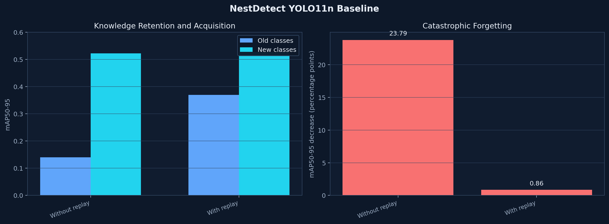

# NestDetect

NestDetect is a research implementation of class-incremental object detection with
YOLO11n and YOLO11n-HoPe. It studies catastrophic forgetting when a detector learns
`laptop` and `book` after first learning `person`, `chair`, and `dining table`.

The repository includes reproducible dataset builders, replay and no-replay
training protocols, replay-free Continuum Memory System (CMS) ablations, evaluation
utilities, five documented checkpoints, a command-line interface, and a Streamlit
application.

## Research highlights

Forgetting is defined as:

```text
old-class mAP50-95 before incremental training
- old-class mAP50-95 after incremental training
```

Lower is better. A negative value indicates positive backward transfer.

### YOLO11n baseline

| Strategy | Old-class mAP50-95 | New-class mAP50-95 | Forgetting |
|---|---:|---:|---:|
| Base model | 0.3778 | — | — |
| Incremental without replay | 0.1399 | 0.5225 | 0.2379 |
| Incremental with replay | **0.3691** | **0.5265** | **0.0086** |

Balanced replay reduced baseline forgetting by approximately **96.4%** without
reducing new-class performance.

### YOLO11n-HoPe and CMS

| Strategy | Old-class mAP50-95 | New-class mAP50-95 | Forgetting |
|---|---:|---:|---:|
| HoPe base model | 0.2037 | — | — |
| HoPe without replay | 0.0639 | 0.4349 | 0.1398 |
| CMS V4 routed memories | 0.2037 | 0.4097 | -0.00002 |
| CMS V5 compressed memory | 0.2035 | 0.4099 | 0.00016 |
| HoPe with replay | 0.2572 | 0.4431 | -0.0535 |
| CMS V4 Replay-Fusion | **0.2573** | **0.4487** | **-0.0536** |

CMS V5 preserves the HoPe base-task score without storing old-task images. Its
plastic parameter delta is compressed by 3.46×. Replay-Fusion has the highest
score on the current validation split, but it is replay-informed and was tuned on
that split; it is not a replay-free result or a held-out test result.

The complete methodology, interpretation, limitations, and conclusions are in
[docs/research-report.md](docs/research-report.md).



## Published checkpoints

| Checkpoint | Intended role | Replay-free |
|---|---|---|
| `models/nestdetect_hope_cms_only_v4.pt` | Default application and prediction-test checkpoint | Yes |
| `models/nestdetect_hope_cms_v5.pt` | Compressed replay-free research checkpoint | Yes |
| `models/nestdetect_hope_cms_v4_replay_fusion.pt` | Highest current validation score | No |
| `models/nestdetect_hope.pt` | Single-detector HoPe replay checkpoint | No |
| `models/nestdetect_final.pt` | YOLO11n replay baseline | No |

Each checkpoint has a matching metadata file with its SHA-256 digest, provenance,
target classes, and evaluation metrics. See [docs/model-card.md](docs/model-card.md).

## Target classes

The detector preserves the original 80-class COCO head and activates five class
IDs during training and inference:

| COCO ID | COCO label | Display label |
|---:|---|---|
| 0 | person | person |
| 56 | chair | chair |
| 60 | dining table | table |
| 63 | laptop | laptop |
| 73 | book | book |

Preserving the COCO80 head prevents pretrained classifier tensors from being
discarded when the active class set grows.

## Repository structure

```text
NestDetect/
├── app.py
├── configs/
│   ├── baseline/
│   ├── hope/
│   ├── ablations/
│   └── models/
├── datasets/                 # manifests and locally generated datasets
├── docs/
├── models/                   # five published checkpoints and metadata
├── results/                  # compact CSV, JSON, and selected figures
├── scripts/                  # dataset, evaluation, plotting, and CMS utilities
├── src/nestdetect/           # installable Python package
├── tests/
└── pyproject.toml
```

## Installation

Requirements:

- Python 3.10 or newer;
- 8 GB RAM or more;
- optional CUDA-compatible GPU for training;
- optional webcam for real-time detection.

```bash
python -m venv .venv
source .venv/bin/activate
python -m pip install --upgrade pip
python -m pip install -e ".[dev]"
```

On Windows PowerShell, activate the environment with:

```powershell
.venv\Scripts\Activate.ps1
```

## Run the application

```bash
python -m streamlit run app.py
```

The application uses the replay-free CMS V4 checkpoint for image and webcam
prediction tests. The model is selected explicitly, so the interface never changes
prediction provenance through an automatic fallback.

## Command-line inference

```bash
nestdetect detect \
  --model models/nestdetect_hope_cms_only_v4.pt \
  --source sample.jpg \
  --output results/detection_outputs/sample.jpg \
  --conf 0.25 \
  --imgsz 640
```

Predictions are filtered to the five target classes unless `--all-classes` is
provided.

## Tests

```bash
pytest
```

The current suite contains 26 tests covering datasets, replay memory, evaluation,
HoPe modules, continual-learning constraints, conditional memory, and optimizers.

## Reproduce the experiments

```bash
python scripts/prepare_coco_subset.py
python scripts/build_datasets.py

nestdetect train configs/baseline/base.yaml
nestdetect train configs/baseline/incremental-no-replay.yaml
nestdetect train configs/baseline/incremental-replay.yaml

nestdetect train configs/hope/base.yaml
nestdetect train configs/hope/incremental-no-replay.yaml
nestdetect train configs/hope/incremental-replay.yaml
```

Evaluation and CMS construction commands are documented in
[docs/reproducibility.md](docs/reproducibility.md).

## Scope and responsible use

The experiments use a small, curated subset of Microsoft COCO 2017 and one
deterministic seed. The reported metrics are research evidence for this controlled
protocol, not production guarantees. The model should not be the sole basis for
decisions affecting safety, rights, or access to services.

The repository does not redistribute COCO images. Dataset details and source terms
are documented in [docs/dataset.md](docs/dataset.md).

## Documentation

- [Architecture](docs/architecture.md)
- [Dataset](docs/dataset.md)
- [Model card](docs/model-card.md)
- [Research report](docs/research-report.md)
- [Replay-free study](docs/replay-free-study.md)
- [Reproducibility](docs/reproducibility.md)

## References

- [Nested Learning / HoPe](https://arxiv.org/abs/2512.24695)
- [Microsoft COCO](https://cocodataset.org/)
- [COCO paper](https://arxiv.org/abs/1405.0312)
- [Ultralytics YOLO documentation](https://docs.ultralytics.com/)
- [Streamlit](https://docs.streamlit.io/)


## Citation

If you use this work, please cite:

Athallah, Z. H. (2026). NestDetect: Mengurangi Catastrophic Forgetting pada YOLO melalui Nested Learning dan Continuum Memory System. Zenodo. https://doi.org/10.5281/zenodo.20958461
